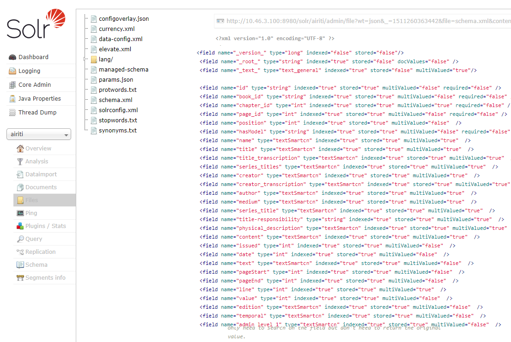
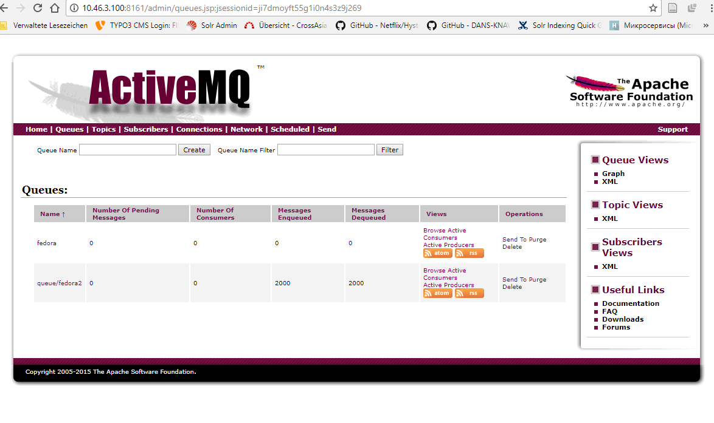
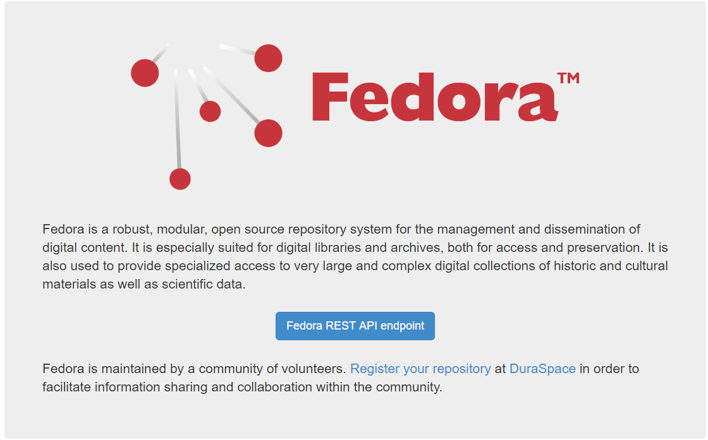
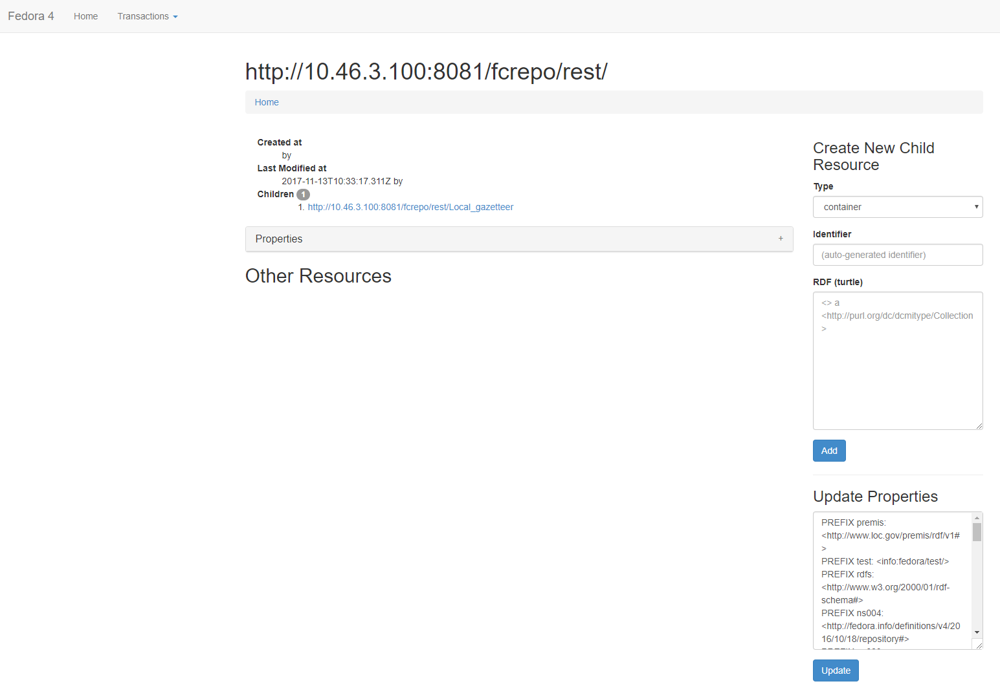

Fedora Solr Camel Dokumentation
====

**Inhalt:**

[1. Einführung und Ziele](#1)

[2. Voraussetzungen](#2)

[3. Instalation](#3)

[4. Java Aplication](#4)

[5. Datenbank und andere Quellen](#5)

## 1. Einführung und Ziele ##

Das Ziel des Projektes ist die Datentransformation und Datenübertragung aus verschiedenen Quellen und Formaten, wie Xml, Pdf, Text, Datenbank mit Hilfe von Apache Camel nach Solr und Fedora. Die Idee ist in einer Sprache die komplette Datenübertragung und Datenspeicherung zu realisieren. Die Daten müssen in Fedora und Solr nach einer Transformation gespeichert werden.

## 2. Voraussetzungen ##
  * Java 1.8
  * Apache Solr (http://lucene.apache.org/solr/)
  * Apache ActiveMQ (http://activemq.apache.org/)
  * Fedora (http://fedorarepository.org/)
  * Apache Camel (http://camel.apache.org/)
  

## 3. Instalation ##
In diesem Abschnitt werden die notwendigen Installationsschritte beschrieben: 
* Apache Solr Instalation
    * Aus http://lucene.apache.org/solr letzte Version herunterladen. 
    * In passende Stelle auspacken
    * Mit Kommando ./solr start - Starten Sie den Solr. Als default wird auf folgende Adresse gestartet: [Solr Staradresse](host:8983/solr).
    * Mit folgende Kommando ist es möglich den Port selbst einlegen zu können: ./solr start -p 8980
    * Erstellen von neuer Kollektion - solr create -c myCollection
    * Solr Konfiguration befindet sich unter ../server/solr/collection_Name/conf
    * Um neue Felder einzulegen muss man schema.xml erweitern.
      
        
         ``<field name="book_id" type="int" indexed="true" stored="true" multiValued="false" required="false" />
           <field name="chapter_id" type="int" indexed="true" stored="true" multiValued="true" required="false" />``
 
  
* Apache Camel Instalation
    
    Apache Camel bietet Übertragungsmecanismus. Die Daten aus den MySql und anderen Formaten (PDF, XML, Text) werden nach 
    Solr übertragen. Apache Camel wird benutzt um die Daten für die Fedora entsprechend vorbereiten.  
     
   * In unseren Fall Apache Camel wird als dependency verwendet: 
   
        ``<dependency>
             <groupId>org.apache.camel</groupId>
             <artifactId>camel-core</artifactId>
             <version>2.20.1</version>
         </dependency>``
           
   * Genaue Nutzung von Apache Camel wird in Java Application beschrieben   
   
   
* Apache Activemq

    Hier wird kurz die Nutzung von Apache Activemq beschriben. Am Anfang sollte es die Datei erstmal in Activemq gesplitet und gespeichert werden und dann aus Activemq nach Solr und Fedora übertragen werden. Später in der Produktion wird es nicht benutzt, aber die Dokumentation kann
       sehr hilfsreich für die spätere Nutzung sein.
      Install Apache Activemq
   * Aus http://activemq.apache.org/download.html letzte Version herunterladen. 
   * In passende Stelle auspacken
   * Mit bin/activemq start - Starten Sie den Activemq.
   * Als default wird Activemq auf Port 8161 gestartet 
     
   * Die Nutzung von ActiveMQ in Camel Verbindung wird in Java Application beschrieben 
   
     
* Fedora
  
   Fedora 4 ist ein robustes und modulares Open-Source-Repository für Speicherung, Verwaltung und Verbreitung
   digitaler Inhalte. Es eignet sich besonders für digitale Bibliotheken und Archive, sowohl für den Zugriff als auch für die Archivierung.  
   
   Install Fedora 4
   
   * Aus http://fedorarepository.org/download letzte Version herunterladen.  
   * Ich habe Fedora als Web Application - *.war in Tomcat installiert 
   * Um Fedora zu starten muss man in entsprechenden Tomcat/bin Verzeichnis setenv.sh Datei einlegen:
   
           #!/bin/sh
           
           JAVA_HOME=/opt/java/latest
           
           # data storage
           JAVA_OPTS="${JAVA_OPTS} -Dfcrepo.modeshape.configuration=classpath:/config/file-simple/repository.json"
           JAVA_OPTS="${JAVA_OPTS} -Dfcrepo.home=/etc/fedora"
           
           # server, memory and GC optimization
           JAVA_OPTS="${JAVA_OPTS} -Djava.awt.headless=true"
           JAVA_OPTS="${JAVA_OPTS} -Dfile.encoding=UTF-8"
           JAVA_OPTS="${JAVA_OPTS} -server"
           JAVA_OPTS="${JAVA_OPTS} -XX:NewSize=2048m"
           JAVA_OPTS="${JAVA_OPTS} -XX:MaxNewSize=8192"
           JAVA_OPTS="${JAVA_OPTS} -XX:MetaspaceSize=1024m"
           JAVA_OPTS="${JAVA_OPTS} -Xms8192m -Xmx8192m"
           JAVA_OPTS="${JAVA_OPTS} -XX:MaxMetaspaceSize=2048m"
           JAVA_OPTS="${JAVA_OPTS} -XX:+UseG1GC"
           JAVA_OPTS="${JAVA_OPTS} -XX:+DisableExplicitGC"
           
           # some ports
           JAVA_OPTS="${JAVA_OPTS} -Dfcrepo.jms.baseUrl=http://10.46.3.100:8080/fcrepo/rest"
           JAVA_OPTS="${JAVA_OPTS} -Dfcrepo.dynamic.jms.port=53525"
           JAVA_OPTS="${JAVA_OPTS} -Dfcrepo.dynamic.stomp.port=53523" 

   * Dfcrepo.home=/etc/fedora - ist ein Speicherort, wo Fedora gespeichert wird.
    
   * Nach Neustart es ist möglich Fedora unter folgende Adresse aufrufen: http://host:8080/fcrepo/rest/
                
   * Es ist möglich Posgres Datenbank als Fedora Speicherort zu nutzen. Das kann sehr aktuell sein, besonderes bei großeren Datenmengen.
   * Postgresql installieren, Datenbank und User anlegen:
  
  
        sudo apt-get update
        sudo apt-get install postgresql postgresql-contrib
        $ sudo -u postgres psql
        > create database fcrepo;
        > create user fedora;
        > alter user user1 password 'fedora';
        > grant all privileges on database fcrepo to fedora;
        > \q
        
  
   * Nach dem Instalation von Postgres muss noch pg_hba.conf in /etc/postgresql/version/main eingestellt werden:
   
   ``host    fedora     fcrepo        127.0.0.1/32            md5``
   
   * setenv.sh muss angepasst werden:  
   
          JAVA_OPTS="${JAVA_OPTS} -Dfcrepo.modeshape.configuration=classpath:/config/jdbc-postgresql/repository.json"
          JAVA_OPTS="${JAVA_OPTS} -Dfcrepo.postgresql.username=<username>"
          JAVA_OPTS="${JAVA_OPTS} -Dfcrepo.postgresql.password=<password>"
          JAVA_OPTS="${JAVA_OPTS} -Dfcrepo.postgresql.host=<default=localhost>"
          JAVA_OPTS="${JAVA_OPTS} -Dfcrepo.postgresql.port=<default=5432>"
   
   * In repository.json die Datenbankname muss übereinstimmen        
  

## 4. Java Aplication ##
In diesem Projekt wird Java verwendet um die Daten nach Solr und Fedora anzupassen und migriren. Das Projekt ist
Maven Projekt gebaut. 
- Aus Datenbank nach Solr

- Aus Datenbank nach Fedora