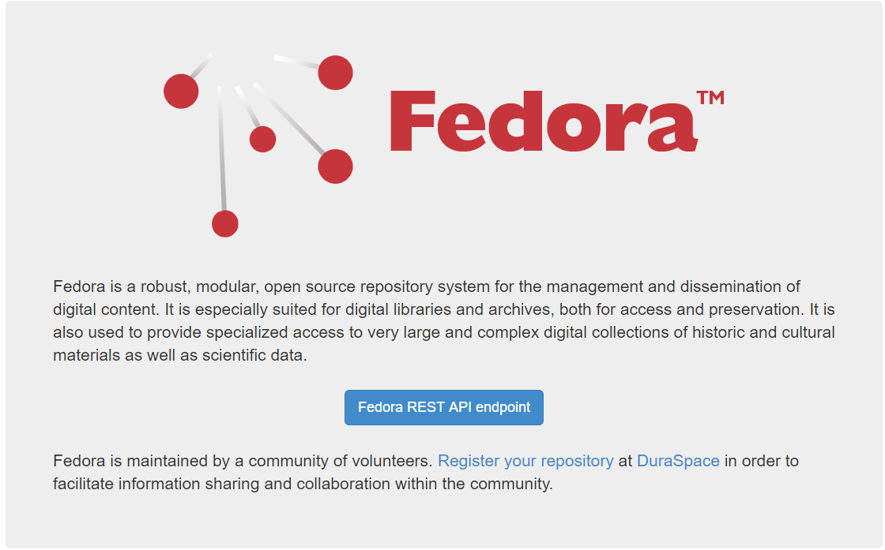

Fedora Solr Camel Dokumentation
====

**Inhalt:**

[1. Einführung und Ziele](#1)

[2. Voraussetzungen](#2)

[3. Instalation](#3)

[4. Java Aplication](#4)

## 1. Einführung und Ziele ##

Das Ziel des Projektes ist die Datentransformation und Datenübertragung aus unterschiedlichen
Quellen und Formaten, wie Xml, Pdf, Text, Datenbank mit Hilfe von Apache Camel nach Solr und Fedora.
Die Idee ist - möglichst versuchen in eine Sprache die komplete Datenübertragung und Datenspeicherung zu realisieren.
Die Daten müssen in Fedora und Solr nach eine Transformation gespeichert werden. 

## 2. Voraussetzungen ##
  * Java 1.8
  * Apache Solr (http://lucene.apache.org/solr/)
  * Apache ActiveMQ (http://activemq.apache.org/)
  * Fedora (http://fedorarepository.org/)
  * Apache Camel (http://camel.apache.org/)
  

## 3. Instalation ##
In diesem Abschnitt wird die nötige Instalationsschritte beschrieben:  
  
  * Apache Solr Instalation
    1. Aus http://lucene.apache.org/solr letzte Version herunterladen. 
    2. In passende Stelle auspacken
    3. Mit bin/solr start - Starten Sie den Solr. 
   Es wird als default auf folgende Adresse gestartet: host:8983/solr.
   Es ist möglich mit folgende Kommando zu starten und den Port selbst einlegen zu können:
   bin/solr start -p 8980
    4. Erstellen von neue Kollektion - solr create -c myCollection
    5. Solr Konfiguration befindet sich unter ../server/solr/collection_Name/conf
    6. Um neue Felder einzulegen muss man schema.xml erweitern.
     
             <field name="book_id" type="int" indexed="true" stored="true" multiValued="false" required="false" />
             <field name="chapter_id" type="int" indexed="true" stored="true" multiValued="true" required="false" />
  
  * Apache Camel Instalation
  
   Apache Camel bietet Übertragungsmecanismus. Die Daten aus den MySql und anderen Formaten (PDF, XML, Text) werden nach 
   Solr übertragen. Apache Camel wird benutzt um die Daten für die Fedora entsprechend vorbereiten.  
   1. In unseren Fall Apache Camel wird als dependency in Maven Projekt verwendet 
   
           <dependency>
             <groupId>org.apache.camel</groupId>
             <artifactId>camel-core</artifactId>
             <version>2.20.1</version>
           </dependency>
   2.   
  * Fedora
  
   Fedora 4 ist ein robustes und modulares Open-Source-Repository für Speicherung, Verwaltung und Verbreitung
   digitaler Inhalte. Es eignet sich besonders für digitale Bibliotheken und Archive, sowohl für den Zugriff als auch für die Archivierung.  
   
   
   * Apache Activemq
   Install Apache Activemq
   1. Aus http://activemq.apache.org/download.html letzte Version herunterladen. 
   2. In passende Stelle auspacken
   3. Mit bin/activemq start - Starten Sie den Activemq. 
   
   Install Fedora 4
   
   1. Aus http://fedorarepository.org/download letzte Version herunterladen.  
   2. Ich habe Fedora als Web Application in Tomcat installiert 
   3. Um Fedora zu starten muss man in tomcat/bin Verzeichnis setenv.sh Datei einlegen:
   
           #!/bin/sh
           
           JAVA_HOME=/opt/java/latest
           
           # data storage
           JAVA_OPTS="${JAVA_OPTS} -Dfcrepo.modeshape.configuration=classpath:/config/file-simple/repository.json"
           JAVA_OPTS="${JAVA_OPTS} -Dfcrepo.home=/etc/fedora"
           
           # server, memory and GC optimization
           JAVA_OPTS="${JAVA_OPTS} -Djava.awt.headless=true"
           JAVA_OPTS="${JAVA_OPTS} -Dfile.encoding=UTF-8"
           JAVA_OPTS="${JAVA_OPTS} -server"
           JAVA_OPTS="${JAVA_OPTS} -XX:NewSize=2048m"
           JAVA_OPTS="${JAVA_OPTS} -XX:MaxNewSize=8192"
           JAVA_OPTS="${JAVA_OPTS} -XX:MetaspaceSize=1024m"
           JAVA_OPTS="${JAVA_OPTS} -Xms8192m -Xmx8192m"
           JAVA_OPTS="${JAVA_OPTS} -XX:MaxMetaspaceSize=2048m"
           JAVA_OPTS="${JAVA_OPTS} -XX:+UseG1GC"
           JAVA_OPTS="${JAVA_OPTS} -XX:+DisableExplicitGC"
           
           # some ports
           JAVA_OPTS="${JAVA_OPTS} -Dfcrepo.jms.baseUrl=http://10.46.3.100:8080/fcrepo/rest"
           JAVA_OPTS="${JAVA_OPTS} -Dfcrepo.dynamic.jms.port=53525"
           JAVA_OPTS="${JAVA_OPTS} -Dfcrepo.dynamic.stomp.port=53523" 

  4. Dfcrepo.home=/etc/fedora - ist ein Speicherort, wo Fedora gespeichert wird 
  5. Nachdem Neustart es ist möglich Fedora unter folgende Adresse aufrufen: http://host:8080/fcrepo/rest/
              
  6. Andere Möglichkeit, die Arbeit von Fedora beschleunigen kann, ist Posgres Datenbank als Fedora Speicherort 
  im Vergleich zu Filesystem. Das kann sehr aktuell sein, besonderes bei großeren Datenbeständen
    
  

## 4. Java Aplication ##
In diesem Projekt wird Java verwendet um die Daten nach Solr und Fedora anzupassen und migriren. Das Projekt ist
Maven Projekt gebaut. 
- Aus Datenbank nach Solr

- Aus Datenbank nach Fedora